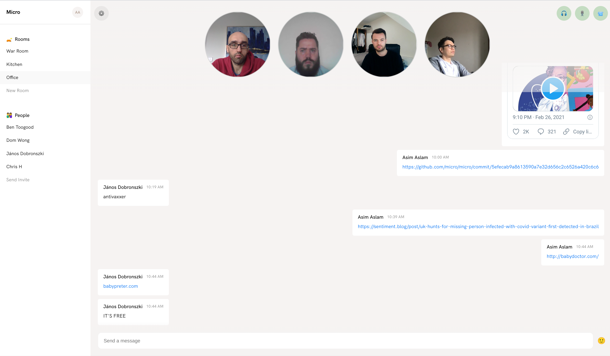

# Distributed

Distributed is a Next.js based Jamstack app for live social chat.

## Live Demo

Signup to the live demo at [distributed.app](https://distributed.app).



## Running demo locally

Distributed is configured via environment variables. Set the environment
variables by creating `.env.local` file in the root of the repo with the
following content:

```
# The micro API endpoint/key
MICRO_API_ENDPOINT=https://api.m3o.com
MICRO_API_KEY=xxxxxxx
MICRO_API_NAMESPACE=xxxxxx

# Sendgrid api key for sending invites
SENDGRID_API_KEY=xxxxxxxx

# Twilio api key/secret/sid for audio/video calls
TWILIO_API_KEY=xxxxxxx
TWILIO_API_SECRET=xxxxx
TWILIO_ACCOUNT_SID=xxxxxx

# Stripe api key to pay for gifs
STRIPE_PUBLIC_KEY=xxxxxx
```

Install application dependencies and start the application:

```
npm install && npm run dev
```

The application is accessible on http://localhost:3000

## License

Distributed is licensed as [Polyform Strict](https://polyformproject.org/licenses/strict/1.0.0/).
